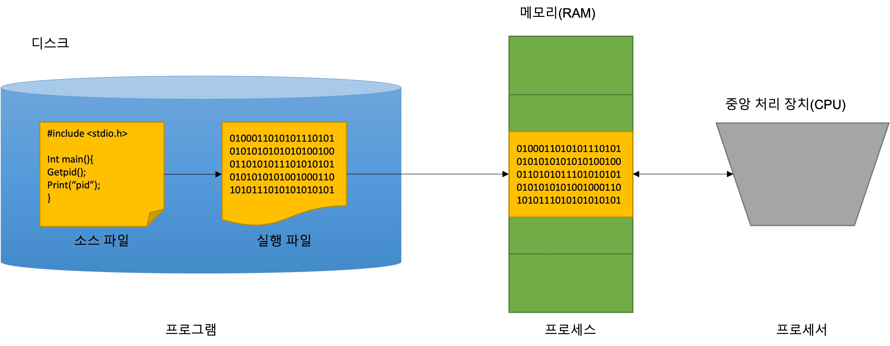

 ## 6장. **프로세스 정보**

  * [6-1 프로세스의 개념](#6-1-프로세스의-개념)
  * [6-2 프로세스 식별](#6-2-프로세스-식별)
  * [6-3 프로세스 실행 시간 측정](#6-3-프로세스-실행-시간-측정)
  * [6-4 환경 변수의 활용](#6-4-환경-변수의-활용)

### 6-1 프로세스의 개념
1. 프로세스의 정의  
프로세스는 실행 중인 프로그램을 의미한다. 즉, 프로세스는 프로세서가 처리 중인 프로그램  
*(프로세서 : CPU, 프로그램 : 유저가 컴퓨처에 작업을 시키기 위한 명령러의 집합)*  

  

2. 프로세스의 구조  
프로그램을 실행하면 프로세스가 생성된다.  
생성된 프로세스는 아래와 같이 메모리에 할당 된다.
  

|영역|설명|
|:--:|--|
|텍스트 영역|실행 코드를 저장하는 공간 프로세스 실행중에 크기가 변하지 않는 고정 영역에 속한다,|
|데이터 영역|프로그램에서 정의한 전역변수를 저장하는 공간 전역 변수는 프로그램을 실행할때 크기가 고정되므로 고정 영역에 할당 된다.|
|힙 영역|프로그램 실행중 동적으로 메모리를 요청하는 경우 할당되는 공간 빈영역&#8594;할당&#8594;할당 해제처럼 산태가 변하는 가변 영역.|
|스택 영역|프로그램에서 정의한 지역변수를 저장하는 메모리 영역 지역 변수를 정의한 부분에서 할당.|
|빈 공간|스택이나 힙과 같이 가변적인 메모리 할당을 위해 유지하고 있는 빈 메모리 영역이다. 프로세스에 할당된 빈 메모리 영역이 모두 소진되면 메모리 부족으로 프로그램 실행이 중단될수도 있다.|

3. 프로세스 상태 변화  
    1. 프로세스는 사용자 모드에서 먼저 실행된다.  
    2. 사용자 모드에서 시스템 호출을 하면 커널 모드로 전황되어 실행한다.  
    3. 수면 중이던 프로세스가 깨어나 실행 대기 상태가 되면 바로 실행할수 있도록 준비한다.  
    4. 커널 모드에서 실행중 입출력 완료를 기다릴때와 같이 더 이상 실행을 계속할 수 없을 때 수면 상태로 전환한다.
  

4. 프로세스 목록 보기  
현재 실행중인 프로세스 목록을 보기 위한 명령어는 **ps** 이다.  
아무 옵션 없이 ps 명령을 사용하면 현재 터미널에서 실행한 프로세스만 출력된다.  
시스템에서 동작하고 있는 전체 프로세스를 보려면 -ef 옵션을 사용한다.

5. 시스템 메모리 정보 보기  
ps 명령 외에도 프로세스를 검색하는 top 명령이 있다. 이 멸령을 현재 실행 중인 프로세스를 주기적으로 확인해 출력한다.  
top 명령은 메모리, 스왑, 현재 실행중인 프로세스 수 등의 정보를 보여준다.  
메모리와 스왑 등에 관한 정보를 직접 검색하려면 sysinfo() 함수를 사용한다.  

* 메모리와 스왑 상태 검색  
int sysinfo(struct sysinfo *info)  
info : 검색 결과를 리턴하는 sysinfo 구조체의 주소  
return value : 사람이 보기 편한 형태의 시간 형태  

### 6-2 프로세스 식별

### 6-3 프로세스 실행 시간 측정

### 6-4 환경 변수의 활용