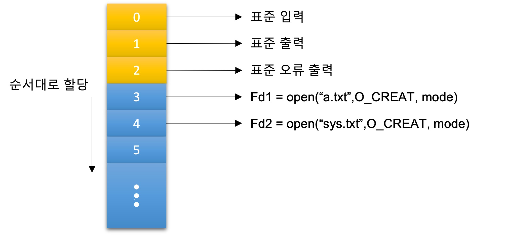

# 4장. **파일 입출력**
  * [4-1 저수준 파일 입출력](#4-1-저수준-파일-입출력)

파일 입출력은 크게 저수준 파일 입출력과 고수준 파일 입출력으로 나뉠수 있다.  
저수준 파일 입출력은 리눅스 커널의 시스템 호출을 이용해는 방법이고, 고수준 파일 입출력은 C언어의 표준 함수로 제공된다.  
저수준 파일 입출력은 속도가 빠르다는 장점이 있지만, 바이트 단위로 파일의 내용을 다루므로 응용프로그램을 작성하려면 적당한 형태의 데이터로 변환하는 함수등을 구현해야한다.
고수준 파일 입출력은 데이터를 바이트 단위로 한정하지 않고 버퍼를 이용해 한꺼번에 읽기와 쓰기를 수행한다.
또한 다양한 입출력 데이터 변환 기능도 구현되어있어, 자료형에 따라 편리하게 이용할수 있다.

## 4-1 저수준 파일 입출력
1. 파일 기술자

모든 저수준 파일 입출력 함수는 파일 기술자(file descriptor)를 사용한다.
파일 기술자는 현재 열려있는 파일을 구분할 목적으로 시스템에서 붙여놓은 번호로, 열린 파일을 참조하는데 사용하는 지시자 역할을 한다.

2. 파일 생성과 열고 닫기

|함수|설명|인자 설명|return value|
|:--:|--|--|--|
|int open(const char *pathname, int flags)|파일 열기|pathname : 열려있는 파일의 경로 flags : 파일 상태 플래그|성공하면 파일 기술자, 실패하면 -1|
|int open(const char *pathname, int flags, mode_t mode)|파일 열기|pathname : 열려있는 파일의 경로 flags : 파일 상태 플래그 mode : 접근 권한|성공하면 파일 기술자, 실패하면 -1|
|int create(const char *pathname, mode_t mode)|파일 생성|pathname : 열려있는 파일의 경로 mode : 접근 권한|성공하면 파일 기술자, 실패하면 -1|
|int close(int fd)|파일 닫기|fd : 파일 기술자|성공하면 0, 실패하면 -1|

* [파일 상태 플래그](#참고-파일-상태-플래그)

3. 파일 읽기와 쓰기

|함수|설명|인자 설명|return value|
|:--:|--|--|--|
|ssize_t read(int fd, void *buf, size_t count)|파일 읽기|fd : 파일 기술자 buf : 파일에 기록할 데이터를 저장한 메모리 영역 count : 가록할 데이터의 크기|실제로 읽은 바이트 수를 return. return값이 0이면 파일 끝에 도달해 더 이상 읽을 내용이 없음을 의미함. 실패하면 -1|
|ssize_t write(int fd, void *buf, size_t count)|파일 읽기|fd : 파일 기술자 buf : 파일에 기록할 데이터를 저장한 메모리 영역 count : 가록할 데이터의 크기|쓰기를 수행한 바이트 수를 return. 실패하면 -1|

##### (참고) 파일 상태 플래그  
OR(|) 연산자로 연결해 지정할수 있음  
|종류|기능|
|:--:|--|
|O_RDONLY|읽기 전용|
|O_WRONLY|쓰기 전용|
|O_RDWR|읽기/쓰기용|
|O_CREAT|파일이 없을 때 생성 모드, 세 번째 인자로 권한을 요구함|
|O_EXCL|파일이 존재하는지 확인|
|O_APPEND|파일의 끝에 내용을 추가|
|O_TRUNC|기존에 파일에 있던 내용을 삭제하고 파일의 길이를 0으로 만듦|
|O_SYNC/ O_DSYNC|쓰기 작업을 요청하면 바로 물리적인 파일에 쓰여짐(버퍼를 통하지 않음) 실행 속도는 늦어지지만 디스크에 확실하게 쓰는 것을 보장|
